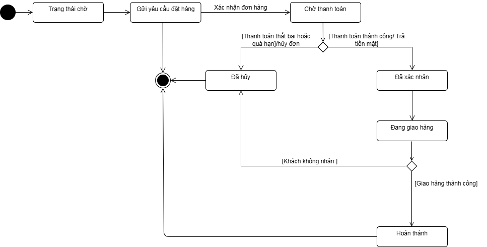
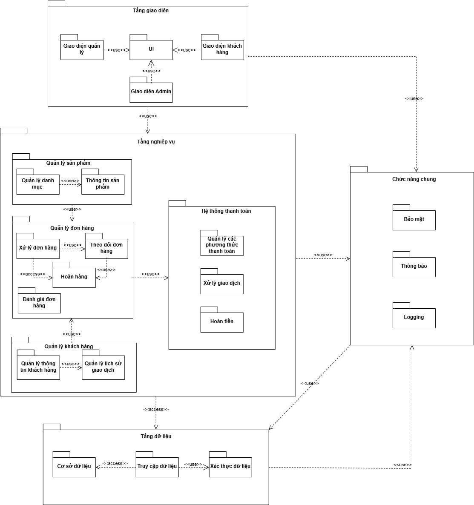
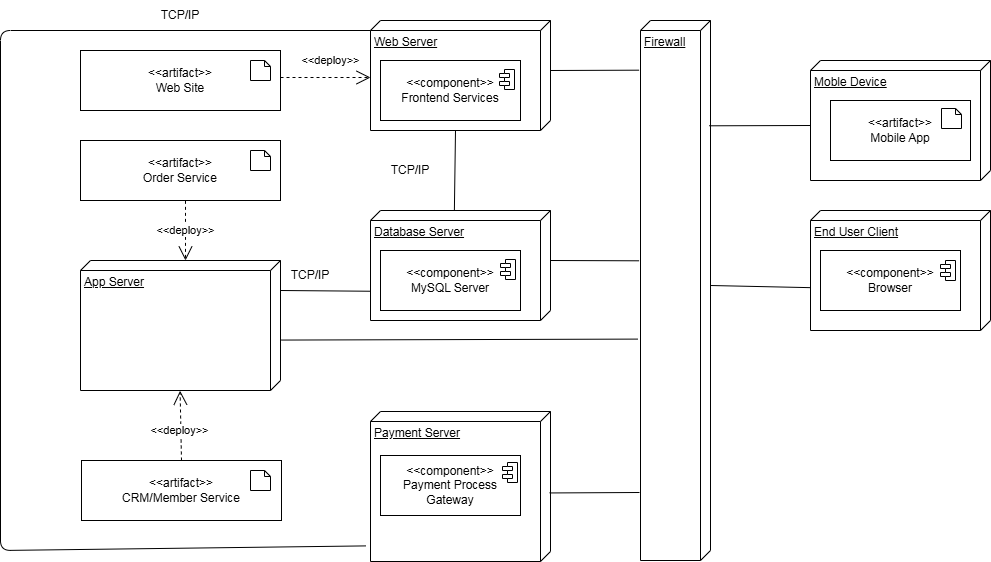

# Online Sales System Modeling with UML

## 1. Project Overview
* **Objective:** Analyze and design a comprehensive E-commerce platform utilizing Object-Oriented Analysis and Design (OOAD) methodology.
* **Scope:** The system integrates core business processes including user management, product browsing, order processing lifecycle, and payment verification.

## 2. Team & My Role
* **Team:** Group 05 - National Economics University (NEU).
* **My Role:** System Analysis Member.
* **My Contributions:**
  * Modeled and constructed core UML diagrams using draw.io, specifically: **Use Case, State, Package, and Deployment Diagrams**.
  * Drafted architectural documentation, detailing system interactions and package dependencies.

## 3. Key Architectural & System Models

### A. Order Lifecycle (State Diagram)
Designed the state machine to track an order's lifecycle from initialization (`Trạng thái chờ`) through payment (`Chờ thanh toán`) and fulfillment (`Đang giao hàng` to `Hoàn thành` or `Đã hủy`).

### B. System Architecture (Package & Deployment Diagrams)
Architected the system into a 3-tier multi-layered model (Presentation, Business Logic, and Data Access) ensuring scalability. Mapped out the physical deployment infrastructure involving Web Servers, Application Servers, and Database nodes communicating via REST APIs and HTTPS protocols.

## 4. Tools & Methodology
* **Design & Modeling:** draw.io
* **Methodology:** UML 2.0, Object-Oriented Analysis and Design (OOAD)
* **Documentation:** Microsoft Word / PDF

## 5. Deliverables
* [View Final Project Report (PDF)](Documents/Báo-cáo-UML-Nhóm-5.pdf)
